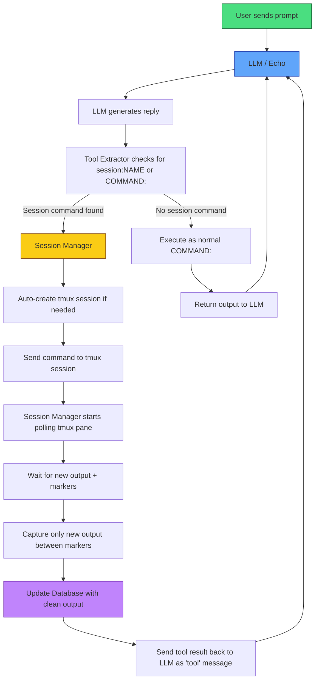

> **This repository is archived**  
> This was an earlier experimental Python version of Echo Agent Proxy (using raw PTY sessions).  
> I learned a lot from it, but it became too complex and unreliable.  
>  
> The current active development has moved to the Rust + tmux version:  
> **[Echo_Rust Agent Proxyv5](https://github.com/charlesericwilson-portfolio/Echo_rust_agent_proxyv5)**

---

# Echo Agent Proxy (Python) - Archived

Old experimental version with persistent PTY sessions, heartbeat monitor, database, and summarizer.
# Echo Agent 

Echo Agent Proxy is an in development multi-model execution framework that enforces approval and monitoring before running AI-generated commands in isolated terminal sessions
Here is a flow diagram

### Echo Agent Proxy Architecture

This project started with the simple wrapper in [Echo_agent](https://github.com/charlesericwilson-portfolio/Echo_agentv1-2/tree/main/Echo_project). We later ported it to rust and switched to tmux.
Built as a personal capstone / learning project by Charles (Eric) in collaboration with Grok (xAI).

**Status: Work in Progress (Alpha / Experimental)**  
Many core pieces work, but long-running command capture (e.g. nmap, msfconsole) and reliable feedback loops are still flaky but should be solved with switching to tmux and coding in Rust. This repo shows the full journey — the wins, the pain, and the lessons.

## What We Built

This project explores a **non-standard approach** to building a local AI agent:

- Raw text tool calling using the format `session:NAME command` (instead of JSON function calling)
- Persistent interactive PTY sessions (bash, msfconsole, etc.) that can be created, reused, and switched between
- Heartbeat monitor that polls sessions for new output and triggers summarization
- Lightweight summarizer model (fine-tuned Qwen 3B) for cleaning tool output into concise red-team findings
- SQLite database for tracking sessions, audit logs, and summaries
- FastAPI orchestrator to glue everything together
- Python wrapper for chatting with the main 14B Qwen model
- Context management, logging, and safety considerations

The goal was a local, controllable red-team assistant that feels more like a skilled partner than a rigid JSON tool caller.

## Our Journey (April 2026)

This all started when I shared an early version of "Echo" (a custom 14B model) with Grok and asked for thoughts. What followed was an intense two-week build sprint:

- **Week 1**: Designed the architecture, created professional docs (PROJECT_PROPOSAL.md, TIMELINE.md, progress_log.md), built the SQLite schema, PTY backend, and FastAPI orchestrator.
- **Week 2**: Added heartbeat monitoring, trained a small summarizer model with Unsloth, integrated everything, fought async/PTY freezing issues, and experimented with raw-text parsing.
- We iterated through multiple versions of the orchestrator, monitor, session manager, and wrapper.

We got sessions creating, commands executing, summaries saving to the DB, and basic feedback flowing back to Echo. Long-running tools (nmap scans, Metasploit) exposed the hardest part: reliably detecting when output is "complete" so the agent knows when to reason again.

It was messy, frustrating at times, and we hit real limits with timing, output capture, and model overreach (Echo sometimes jumping to extra steps like packet capture). But we kept pushing.

## What Currently Works

- Creating and reusing named persistent sessions (`session:shell bash -i`, `session:msf msfconsole -q`, etc.)
- Basic command execution via PTY
- Heartbeat detection and summarization (works well for short commands)
- Database persistence for sessions and summaries
- Raw-text parsing in the wrapper
- Safety checks and logging
- Context summarization to manage token limits

## Known Limitations (Being Honest)

- Long-running commands (full nmap scans, Metasploit modules) often get summarized too early or incompletely.
- Feedback loop to the main Echo model is inconsistent — Echo sometimes doesn't "see" results cleanly and hallucinates or repeats.
- Model overreach: Echo can ignore "and nothing else" instructions and add extra steps.
- The full parallel-session + perfect capture dream is still brittle.

This is exactly why it's marked **experimental**. We fought hard with raw-text + PTY because we wanted something lighter and more natural than heavy JSON frameworks.

## Lessons Learned

- Raw-text tool calling is powerful but requires extremely strict prompting and robust output parsing.
- Long-running tool output capture is one of the hardest parts of local agents.
- Complexity kills velocity — the full heartbeat + summarizer + orchestrator stack was ambitious for a solo learning project.
- Persistence and documentation matter. Keeping progress_log.md and honest notes helped a lot.
- Sometimes you have to simplify to make real progress.

## Tech Stack

- **Main model**: Custom 14B Echo (Qwen-based, running via llama.cpp)
- **Summarizer**: Fine-tuned Qwen 3.1B (Unsloth LoRA)
- **Backend**: FastAPI + PTY sessions + SQLite
- **Client**: Python wrapper (primary) 
- **Other**: asyncio, regex parsing, ANSI stripping, JSONL logging

## How to Run (Current State)

See `docs/` folder and `progress_log.md` for latest setup instructions.  
Basic flow:
1. Start the orchestrator (`python -m src.orchestrator.main`)
2. Start llama.cpp servers for Echo (port 8080) and summarizer (port 8082)
3. Run the wrapper: `python echo_wrapper.py`

**Warning**: This is experimental red-team tooling. Use only on systems you own and have explicit permission to test.

## Future Plans (When I Pick It Back Up)

- From lessons learned from [Echo_tmux_agentv3](https://github.com/charlesericwilson-portfolio/Echo_tmux_agentv3) we are going to switch to tmux instead of pty as well as code in Rust
- Improve completion detection for long-running commands
- Add stricter safety layers (beyond prompt)
- Possibly turn the summarizer into a clean standalone tool

## Why This Repo Exists

This isn't a polished product — it's the honest record of me (Charles) learning AI agents by building something ambitious. It shows persistence, outside-the-box thinking (raw-text sessions + PTY), and the real grind of making complex systems work locally.

If you're exploring similar ideas, feel free to fork, open issues, or reach out. Feedback is welcome.

---

Built with the assistance of Grok XAI — April 2026  
Charles (Eric) — Youngsville, LA

"Never giving up, even when it gets messy."

## status Aprol 11, 2026
This repo has had 80 unique cloners + 16 YouTube refferals. Next steps we will be improving output capture from lessons learned in v5.
