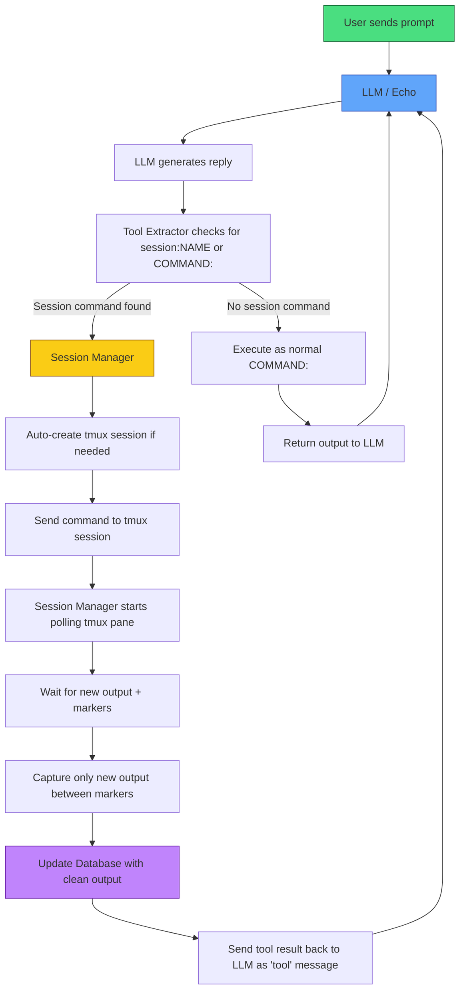

> The current active development has moved to the Rust + tmux version:  
> **[Echo_Rust Agent Proxyv5](https://github.com/charlesericwilson-portfolio/Echo_rust_agent_proxyv5)**

---

# Echo Agent Proxy (Python) - Archived

Old experimental version with persistent PTY sessions, heartbeat monitor, database, and summarizer.
# Echo Agent 

Echo Agent Proxy is an in development multi-model execution framework that enforces approval and monitoring before running AI-generated commands in isolated terminal sessions
Here is a flow diagram

### Echo Agent Proxy Architecture

# Echo Agent Proxy

This project started with the simple wrapper in [Echo_agent v1-2](https://github.com/charlesericwilson-portfolio/Echo_agentv1-2/tree/main/Echo_project).  
We later ported parts to Rust and experimented with tmux for better persistent sessions.

**Built as a personal capstone / learning project** by Charles (Eric) in collaboration with Grok (xAI).

**Status:** Work in Progress (Alpha / Experimental)

## What We Built

A local AI red-team agent using **raw-text tool calling** (`session:NAME command`) instead of JSON function calling.

Key features:
- Persistent interactive sessions (bash, msfconsole, etc.)
- Heartbeat monitor + summarizer for cleaning tool output
- SQLite database for sessions, audit logs, and summaries
- FastAPI orchestrator
- Python wrapper for chatting with the main 14B Echo model

The goal was a controllable, natural-feeling local red-team assistant that feels more like a skilled partner than a rigid tool caller.

## Our Journey (April 2026)

Started when I shared an early version of "Echo" (a custom 14B model) with Grok and asked for thoughts. What followed was an intense build sprint:

- Designed the architecture and created professional docs (PROJECT_PROPOSAL.md, TIMELINE.md, progress_log.md)
- Built SQLite schema, PTY backend, FastAPI orchestrator, and heartbeat summarizer
- Trained a small 3.1B summarizer model with Unsloth
- Fought async/PTY freezing issues and output capture problems
- Iterated through multiple versions of the orchestrator, monitor, and wrapper

We got sessions creating, commands executing, summaries saving, and basic feedback flowing. Long-running tools (nmap, Metasploit) showed the hardest challenge: reliably detecting when output is complete.

It was messy and frustrating at times, but we kept pushing.

## Current Status (April 11, 2026)

**Traction so far:**
- v1-v2: 184 unique cloners + 2 YouTube links
- v3: 107 unique cloners
- v4: 80 unique cloners + 16 YouTube referrals
- v5 (Rust hybrid): 123 unique cloners + 14 YouTube referrals (in 2 days)

The entire portfolio has **42 unique cloners** across all repos.

v4 (this Python proxy) is the version that got the most YouTube attention and stars. We are currently upgrading it to use tmux + cleaner output capture based on lessons learned from v5.

## What Currently Works
- Creating and reusing named persistent sessions
- Basic command execution
- Heartbeat detection and summarization (better for short commands)
- Database persistence
- Raw-text parsing in the wrapper

## Known Limitations
- Long-running commands (full nmap scans, Metasploit modules) can still be summarized too early or incompletely.
- Feedback loop to the main Echo model is sometimes inconsistent.
- Model overreach: Echo can ignore "and nothing else" instructions.

This is experimental. We chose raw-text + PTY because we wanted something lighter and more natural than heavy JSON frameworks.

## Lessons Learned
- Raw-text tool calling is powerful but requires strict prompting and robust output parsing.
- Reliable long-running tool capture is one of the hardest parts.
- Sometimes you have to simplify to make real progress.
- Persistence and honest documentation matter.

## Tech Stack
- Main model: Custom 14B Echo (Qwen-based, via llama.cpp)
- Summarizer: Fine-tuned Qwen 3.1B (Unsloth LoRA)
- Backend: FastAPI + PTY/tmux sessions + SQLite
- Client: Python wrapper

## How to Run (Current State)

See `docs/` folder and `progress_log.md` for latest instructions.

Basic flow:
1. Start the orchestrator
2. Start llama.cpp servers for Echo (port 8080) and summarizer (port 8082)
3. Run the wrapper: `python echo_wrapper.py`
4. Or fill in paths and run echo_start_all.sh

**Warning**: Experimental red-team tooling. Use only on systems you own and have permission to test.

## Future Plans
- Improve completion detection for long-running commands
- Add stricter safety layers
- Create better datasets for session vs command decision making

## Why This Repo Exists

This is the honest record of me (Charles) learning AI agents by building something ambitious. It shows the wins, the pain, the mistakes, and the lessons.

If you're exploring similar ideas, feel free to fork, open issues, or reach out. Feedback is welcome.

---
Built with the assistance of Grok (xAI) — April 2026  
Charles (Eric) — Youngsville, LA  
"Never giving up, even when it gets messy."
